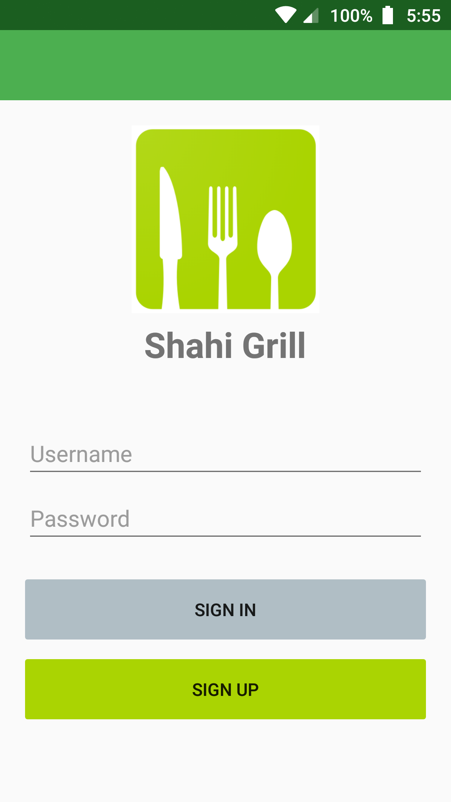
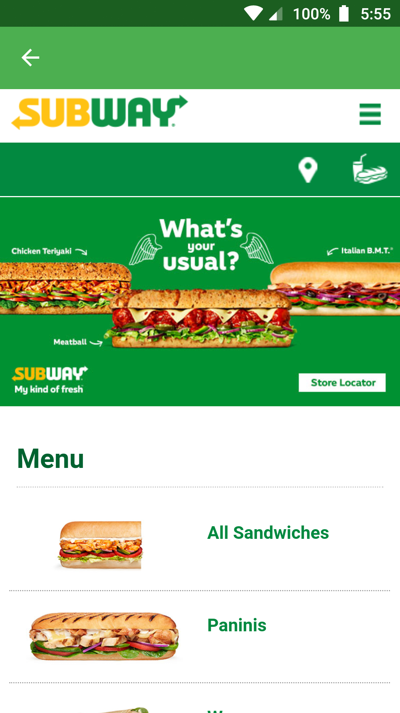

# Shahi Grill
<b>31257 Information Systems Development Methodologies Autumn 2019</b>    
Vincent Akena <b>13268646</b>, Nathan Attard <b>13246273</b>, Rheshav Maharaj <b>13229620</b> 
<b>Technologies used</b>
- <b>Visual Studio 2019</b> as the IDE of choice
- <b>Visual Studio Code</b> as the text editor of choice
- <b>Xamarin Forms</b> as the cross-platform technology
- <b>C# .NET and XAML</b> as the programming/markup languages of choice

<b>Supported operating systems</b>
- <b>Android:</b> Minimum 7.1 Nougat (API level 25) - </b> Targeted 9.0 Pie (API level 28)
- <b>iOS:</b> TBD
- <b>Windows 10:</b> TBD

 

  
   
  

   
   
  

